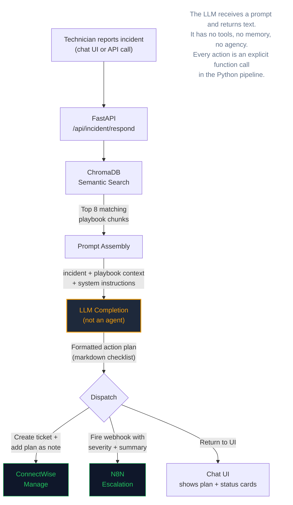

# Architecture

## How It Works

Gone-Phishing is a **deterministic pipeline**, not an AI agent. The LLM does not make decisions, use tools, or loop. It receives a structured prompt and returns formatted text — the same way a template engine fills in a form, except the output is natural language.

### Why This Matters for Incident Response

During a live incident, you need **predictable, auditable behavior**. An autonomous agent that decides its own next steps is a liability in an IR context. This engine:

- Follows the same path every time: search → assemble → generate → dispatch
- Every step is logged and inspectable
- The LLM never sees credentials, ticket IDs, or internal systems
- CW and N8N integrations are explicit function calls, not agent tool-use

---

## Pipeline Flow

```
                         Gone-Phishing IRP Engine
 ┌─────────────────────────────────────────────────────────────────────┐
 │                                                                     │
 │   ┌──────────┐     ┌──────────────┐     ┌──────────────────────┐   │
 │   │  Chat UI  │────▶│   FastAPI     │────▶│  ChromaDB            │   │
 │   │ (browser) │     │  /api/incident│     │  (vector search)     │   │
 │   └──────────┘     │  /respond     │     │                      │   │
 │                     └──────┬───────┘     │  11 NIST 800-61      │   │
 │                            │             │  playbooks embedded   │   │
 │                            │             └──────────┬───────────┘   │
 │                            │                        │               │
 │                            │   matched playbook     │               │
 │                            │   chunks returned      │               │
 │                            ◀────────────────────────┘               │
 │                            │                                        │
 │                    ┌───────▼───────┐                                │
 │                    │ Prompt Assembly│                                │
 │                    │               │                                │
 │                    │ incident desc  │                                │
 │                    │ + playbook ctx │                                │
 │                    │ + system prompt│                                │
 │                    └───────┬───────┘                                │
 │                            │                                        │
 │                            │  structured prompt                     │
 │                            │  (read-only, no tools)                 │
 │                            ▼                                        │
 │  ┌─────────────────────────────────────────────────────────────┐   │
 │  │                    LLM Provider (BYOM)                       │   │
 │  │                                                              │   │
 │  │  The LLM is a COMPLETION ENGINE, not an agent.               │   │
 │  │                                                              │   │
 │  │  It receives:  prompt with incident + playbook context       │   │
 │  │  It returns:   formatted action plan (markdown)              │   │
 │  │                                                              │   │
 │  │  It does NOT:  call tools, access systems, make decisions,   │   │
 │  │                loop, or choose next steps                    │   │
 │  │                                                              │   │
 │  │  Providers: Claude | GPT-4o | Gemini | Ollama (local)       │   │
 │  └──────────────────────────┬──────────────────────────────────┘   │
 │                             │                                       │
 │                             │  action plan text                     │
 │                             ▼                                       │
 │                     ┌───────────────┐                               │
 │                     │  Dispatch      │                               │
 │                     │  (parallel)    │                               │
 │                     └───┬───────┬───┘                               │
 │                         │       │                                   │
 │              ┌──────────▼┐  ┌───▼──────────┐                       │
 │              │ ConnectWise│  │ N8N Webhook   │                       │
 │              │ REST API   │  │              │                       │
 │              │            │  │ /irp-escalate│                       │
 │              │ - Create   │  │              │                       │
 │              │   ticket   │  │ - Email      │                       │
 │              │ - Add plan │  │ - Teams      │                       │
 │              │   as note  │  │ - Slack      │                       │
 │              └────────────┘  └──────────────┘                       │
 │                                                                     │
 └─────────────────────────────────────────────────────────────────────┘
```

## Mermaid (renders on GitHub)



## Component Responsibilities

| Component    | Role                 | What It Does NOT Do                                   |
| ------------ | -------------------- | ----------------------------------------------------- |
| **Chat UI**  | Input/output         | Does not call LLM directly                            |
| **FastAPI**  | Orchestration        | Does not generate text                                |
| **ChromaDB** | Playbook retrieval   | Does not rank by severity                             |
| **LLM**      | Text generation      | Does not call APIs, create tickets, or make decisions |
| **CW REST**  | Ticket lifecycle     | Does not choose what to write                         |
| **N8N**      | Notification fan-out | Does not determine who to notify (pipeline tells it)  |

## Data Flow (What the LLM Sees vs. Doesn't See)

| LLM Receives                     | LLM Never Sees                                           |
| -------------------------------- | -------------------------------------------------------- |
| Incident description (from user) | API keys or credentials                                  |
| Playbook text (from ChromaDB)    | CW ticket IDs or board config                            |
| System prompt (static)           | N8N webhook URLs                                         |
| Severity level (if provided)     | Internal network topology                                |
|                                  | Client names or PII (unless in the incident description) |

## Graceful Degradation

Each integration is independent. If one is down, the others still work:

| If This Is Down... | What Happens                                                             |
| ------------------ | ------------------------------------------------------------------------ |
| LLM provider       | Pipeline fails (required) — switch providers with one env var            |
| ChromaDB           | Pipeline fails (required) — auto-rebuilds from playbook files on restart |
| ConnectWise        | Action plan still generates, UI shows "CW: Not configured"               |
| N8N                | Action plan + CW ticket still work, UI shows "N8N: Ready to connect"     |
